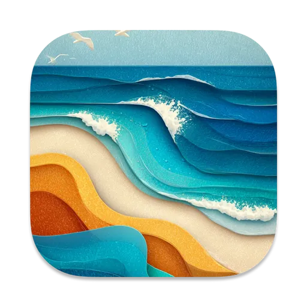
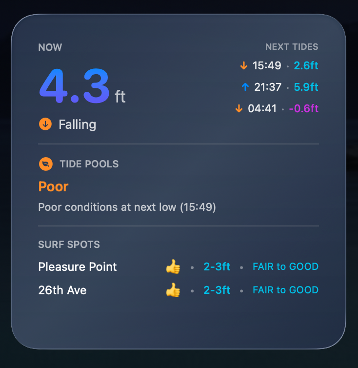

# MyTides




A macOS widget app for tracking tide conditions and surf spots in Santa Cruz.

## Features

- **Real-time Tide Data**: Current tide height and rising/falling status
- **Tide Pool Conditions**: Smart recommendations for the best times to explore tide pools
- **Surf Spot Ratings**: Live conditions from multiple Santa Cruz surf spots including Pleasure Point and 26th Avenue
- **Multiple Widget Sizes**: Small, Medium, and Large widget options
- **Liquid Glass Design**: Beautiful translucent design following Apple's latest design paradigms

## Widget Preview



## Surf Spots Tracked

- Pleasure Point
- 26th Avenue
- The Hook
- Steamer Lane
- Cowell's
- Capitola

## Data Sources

Tide and surf condition data is fetched from the Surfline API, providing accurate and up-to-date information for Santa Cruz area beaches.

## Installation

### Option 1: Download Pre-built App (Easiest)

1. Download the latest `MyTides.dmg` from the [Releases page](https://github.com/weilandia/mytidesapp/releases)
2. Open the DMG file
3. Drag MyTides to your Applications folder
4. Launch MyTides from Applications (you can quit it after launching)
5. Right-click on your desktop and select "Edit Widgets"
6. Search for "MyTides" and add the widget in your preferred size

### Option 2: Build from Source

1. Clone the repository:
   ```bash
   git clone https://github.com/weilandia/mytidesapp.git
   cd mytidesapp
   ```

2. Build the DMG installer:
   ```bash
   ./build-dmg.sh
   ```

3. Install from the generated `MyTides.dmg`:
   - Open the DMG file
   - Drag MyTides to Applications
   - Launch MyTides once from Applications
   - Add the widget from desktop → Edit Widgets

### Option 3: Development Build

1. Open `mytidesapp.xcodeproj` in Xcode
2. Select Product → Archive
3. Click "Distribute App" → "Copy App"
4. Save to your Applications folder
5. Launch the app once, then add the widget

## Widget Not Showing?

If the widget doesn't appear after installation:
1. Make sure you've launched MyTides at least once from Applications
2. Try logging out and back in to macOS
3. Check System Settings → Privacy & Security → Extensions → MyTides is enabled

## Requirements

- macOS 14.0 or later
- Xcode 15.0 or later
